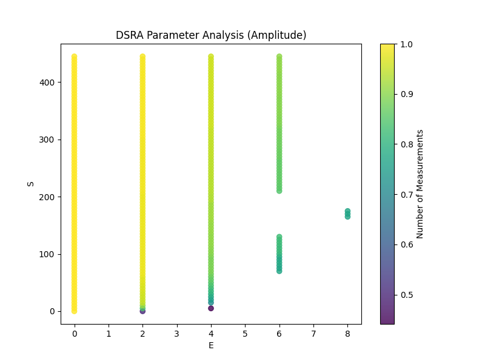
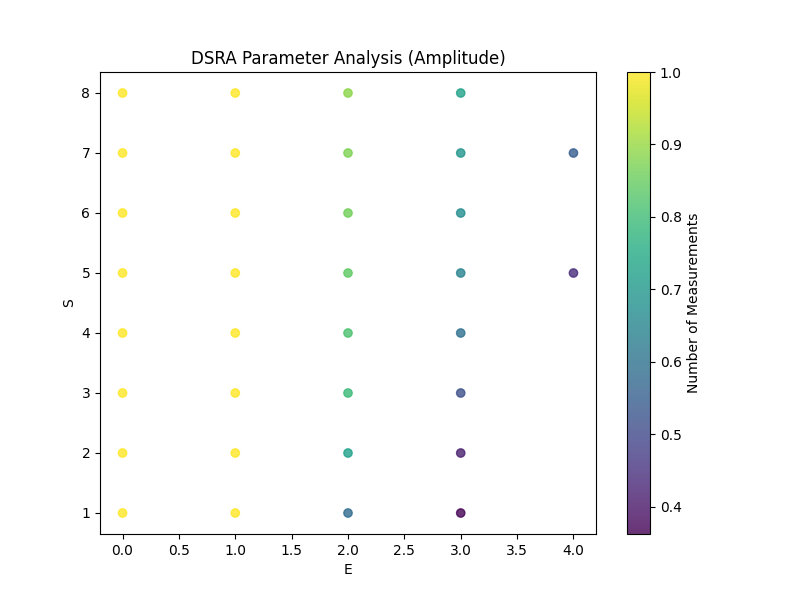
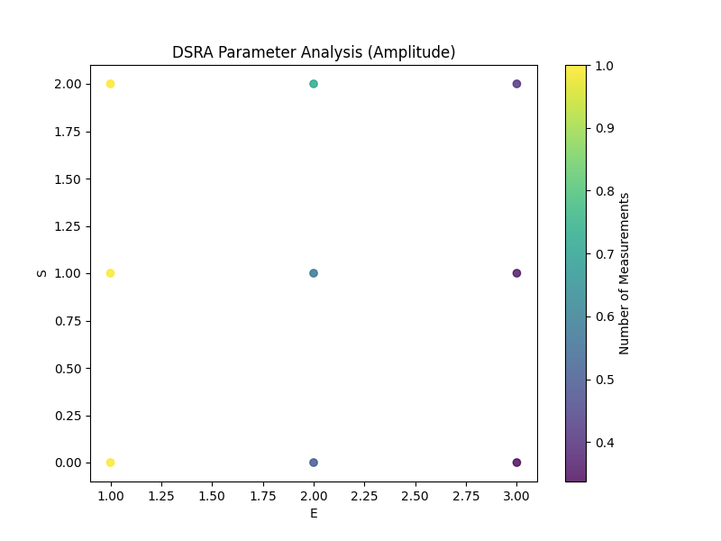

# DSRA-PMLO

**A parametric adaptive sampling algorithm for efficient IoT data collection.**

DSRA-PMLO helps reduce sensor data transmission by selecting fewer sampling points while keeping the reconstructed signal within a user-defined error threshold.

## Result Demonstration

https://github.com/user-attachments/assets/a74d40a2-fe6e-4e91-8129-8563600149d8

> *Above: Dynamic demonstration of the adaptive sampling process.*

## Project Overview

In IoT and wireless sensor networks, data transmission is often one of the most energy-consuming operations. This project searches for two adaptive sampling parameters:

- **E**: the base sampling interval.
- **S**: the sensitivity to signal change.

The algorithm reconstructs the original signal from selected sampling points and reports the reconstruction error and sampling reduction.

## Current Python Project Structure

```text
drsa_pmlo/
├── pyproject.toml
├── README.md
└── src/
    └── dsra_pmlo/
        ├── __init__.py
        ├── base.py
        ├── manual.py
        ├── automated.py
        ├── use_case.py
        └── data/
            └── your_data.txt or your_data.csv
```

The main file users should edit and run is:

```text
src/dsra_pmlo/use_case.py
```

Do not run `automated.py`, `manual.py`, or `base.py` directly. They are package modules.

## Video Demonstration

[](video_address)

> *Click the badge above to watch a short video on how to use the Manual and Automated modes.*

## Environment Setup

### Option 1: Local Setup

From the project root:

```bash
cd /path/to/drsa_pmlo
python3 -m pip install -e .
```

Run the project:

```bash
python3 -m dsra_pmlo.use_case
```

You can also use the installed command:

```bash
dsra-use-case
```

### Option 2: Google Colab Setup

In Colab, install the project as a Python package before importing it.

Replace `YOUR_USERNAME/YOUR_REPOSITORY` with your GitHub repository path.

```python
!git clone https://github.com/YOUR_USERNAME/YOUR_REPOSITORY.git
%cd YOUR_REPOSITORY
!python -m pip install -e .
```

Then import the package:

```python
from dsra_pmlo.manual import DSRAManual
from dsra_pmlo.automated import DSRAAutomated
```

Or run the configured use case:

```python
!python -m dsra_pmlo.use_case
```

If you upload the project folder manually to Colab instead of cloning from GitHub, make sure the current working directory is the repository root, the folder that contains `pyproject.toml`, before running:

```python
!python -m pip install -e .
```

## Data Setup

Place your `.txt` or `.csv` data files in:

```text
src/dsra_pmlo/data/
```

The first row must contain column names. Example:

```text
Time    Amplitude
0.0     -0.0200
0.1      2.3366
```

In `src/dsra_pmlo/use_case.py`, update:

```python
config = {
    "file": "src/dsra_pmlo/data/synthetic_data_50Hz.txt",
    "mode": "automated",
    "target_col": "Amplitude",
    "target_size": 400,
    "threshold": 2,
    "manual_step1_e": (0, 30, 2),
    "manual_step1_s": (0, 450, 5),
}
```

- `file`: path to your dataset.
- `mode`: choose `"automated"` or `"manual"`.
- `target_col`: the column to reconstruct.
- `target_size`: resize the dataset for testing; set to `None` to use the full file.
- `threshold`: maximum accepted MAAPE error percentage.
- `manual_step1_e`: the first broad E range used in manual mode.
- `manual_step1_s`: the first broad S range used in manual mode.

## Which Mode Should I Use?

| Feature | Manual Mode | Automated Mode |
| :--- | :--- | :--- |
| User effort | User chooses the E/S zoom area | Program searches automatically |
| Speed | Faster, because the user narrows the search | Slower, because the program explores ranges |
| Visualization | Three zoom-in grid search plots | Final reconstruction/evaluation plot |
| Best for | Teaching, inspection, controlled tuning | Set-and-run optimization |

## Automated Mode

Use automated mode when you want the program to find E and S with minimal user input.

In `use_case.py`:

```python
config["mode"] = "automated"
```

Then run:

```bash
python3 -m dsra_pmlo.use_case
```

Automated mode performs a **Coarse-to-Fine Grid Search**, then refines the result with dual annealing optimization. It prints the selected E/S values and plots the test-set reconstruction.

## Manual Mode

Use manual mode when you want the user to inspect the E/S search area and choose where to zoom in.

In `use_case.py`:

```python
config["mode"] = "manual"
```

Then run:

```bash
python3 -m dsra_pmlo.use_case
```

Manual mode guides the user through three grid-search plots before dual annealing optimization:

1. **Coarse Grid Search**  
   The program plots the first broad E/S search area. The user defines this first range in `config`:

   ```python
   "manual_step1_e": (0, 30, 2),
   "manual_step1_s": (0, 450, 5),
   ```

2. **Zoomed Grid Search**  
   The program suggests a second E/S range based on Step 1. The user can press Enter to accept or type a custom range:

   ```text
   start,stop,step
   ```

   Example:

   ```text
   E range as start,stop,step [suggested (1, 9, 1)]: 2,6,1
   S range as start,stop,step [suggested (0, 8, 1)]: 0,10,1
   ```

3. **Fine Grid Search**  
   The program suggests a third, smaller E/S range based on Step 2. The user again accepts the suggestion or enters their own range. This Step 3 range is then used for dual annealing optimization.

After Step 3, the selected E/S area is passed to dual annealing optimization, then the result is evaluated on the test set.

If the user presses Enter or enters invalid input, the program uses a safe suggested range instead of crashing.

## Result Graph

The final graph shows:

- **Original Signal** in orange.
- **DSRA Reconstruction** in blue dashed lines.
- **Sampling Points** along the bottom baseline.
- x-axis: `Time(S)`
- y-axis: `Data value`

## Images To Add Later

Create this folder for README images:

```text
docs/assets/
```

Suggested image files:

```text
docs/assets/manual_coarse_grid_search.png
docs/assets/manual_zoomed_grid_search.png
docs/assets/manual_fine_grid_search.png
docs/assets/manual_final_reconstruction.png
docs/assets/automated_final_reconstruction.png
```

Recommended README placement:

### Manual Mode Example

Add the coarse grid search image here:

```markdown

```

Caption idea: *The coarse grid search helps the user locate the general E/S area worth zooming into.*

Add the fine grid search image here:

```markdown

```

Caption idea: *The zoomed grid search focuses on the selected E/S area from the coarse search.*

Add the fine grid search image here:

```markdown

```

Caption idea: *The fine grid search gives the user one last zoom-in before dual annealing optimization.*

Add the final reconstruction image here:

```markdown

```

Caption idea: *The final reconstruction compares the original signal, reconstructed signal, and selected sampling points.*

### Automated Mode Example

Add the automated reconstruction image here:

```markdown

```

Caption idea: *Automated mode runs the coarse-to-fine grid search and final optimization without user-selected zoom ranges.*

## Using The Package In Your Own Python Code

```python
from dsra_pmlo.automated import DSRAAutomated

model = DSRAAutomated(
    filepath="src/dsra_pmlo/data/synthetic_data_50Hz.txt",
    target_col="Amplitude",
    similarity_threshold=2,
)

model.load_data(target_size=400)
_, seeds = model.run_iterative_grid_search()
E, S, reduction, error, reconstructed = model.optimize_and_reconstruct(seeds)
model.evaluate_test_set(E=E, S=S)
```

Manual mode:

```python
from dsra_pmlo.manual import DSRAManual

model = DSRAManual(
    filepath="src/dsra_pmlo/data/synthetic_data_50Hz.txt",
    target_col="Amplitude",
    similarity_threshold=2,
)

model.load_data(target_size=400)
model.plot2d(range(0, 30, 2), range(0, 450, 5))
```

## Troubleshooting

### ImportError: attempted relative import

This happens if you run a module file directly, for example:

```bash
python3 src/dsra_pmlo/automated.py
```

Instead, run the package entry point:

```bash
python3 -m dsra_pmlo.use_case
```

Or install first:

```bash
python3 -m pip install -e .
```

### Python cannot find `dsra_pmlo`

Make sure you installed from the repository root:

```bash
python3 -m pip install -e .
```

The repository root is the folder containing `pyproject.toml`.

## Questions & Feedback

Please open a GitHub Issue so questions, fixes, and examples stay visible for future users.
